# AI-Powered Personalised Learning Path Recommender

**Tell it what you want to become. Get back the order to learn it in.**

Recommending *relevant* courses is easy, and it is not the problem. Learners get
stuck on **sequence**. So this system generates a roadmap from a prerequisite
graph and a topological sort — not from a similarity ranking. An item can never
be scheduled before the things it depends on, and that property is asserted in
the test suite for every goal and every learner shape.

```bash
pip install -r requirements.txt && python run.py     # → http://127.0.0.1:8000
```

No API key required. No build step. Runs on a single SQLite file, or on
Postgres by setting one environment variable.

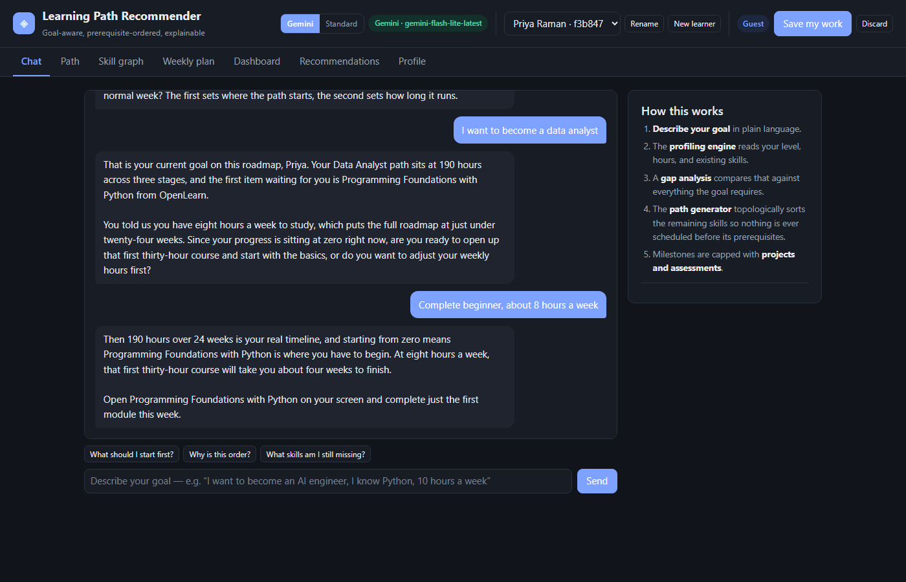

---

## Contents

| | |
|---|---|
| [The problem](#the-problem-sequence-not-relevance) | Why a ranked list is the wrong answer |
| [See it work](#see-it-work) | Every screen, with what it proves |
| [How it works](#how-it-works) | The pipeline, module by module |
| [Explainability](#nothing-is-a-black-box) | Where every number comes from |
| [Adaptation](#it-adapts-to-what-you-actually-do) | Feedback, pace, history |
| [The assistant](#the-assistant-works-without-an-api-key) | Five providers, or none |
| [Accounts](#accounts-guests-and-several-paths-at-once) | Sign-in, guests, and running several goals |
| [API](#api) · [Testing](#testing) · [Deploying](#serving-it-to-other-people) | Reference |

---

## The problem: sequence, not relevance

Search "machine learning" and thousands of credible courses come back. A learner
aiming at ML engineering is not short of relevant material — they are short of an
**order** to consume it in.

That gap has a specific shape:

> Relevance is a property of **one item** against a query.
> A learning path is a property of a **set of items** against a dependency
> structure.

Deep Learning is relevant to the goal and useless as a first step, because it
rests on linear algebra, Python, and classical ML the learner may or may not
hold. A ranking function cannot express that constraint. A graph can.

**Concretely:** ask this system for an AI engineering path and stage 2 contains
Node.js and REST API design. Not because they sound like AI, but because
`llm-engineering` depends on `rest-api` in the graph. A keyword recommender
never finds that edge.

---

## See it work

Nine screens, each one demonstrating a different claim.

### It asks when a goal is ambiguous, instead of guessing

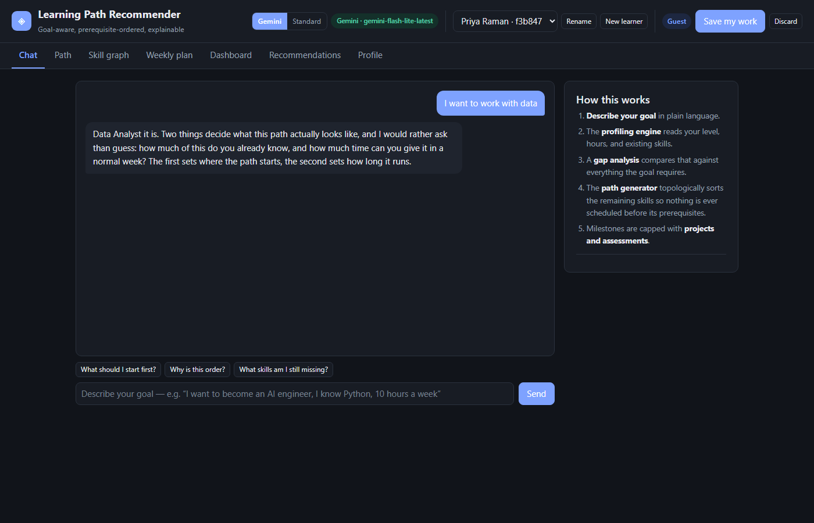

"I want to work with data" describes at least three careers whose first six
months diverge sharply. A wrong roadmap costs a learner months, so an unanswered
question is cheaper than a confident mistake. Note the badge, top right: even
with Gemini live, the model reported only 0.4 confidence, and the system asked.

### The roadmap: ordered, staged, and justified line by line

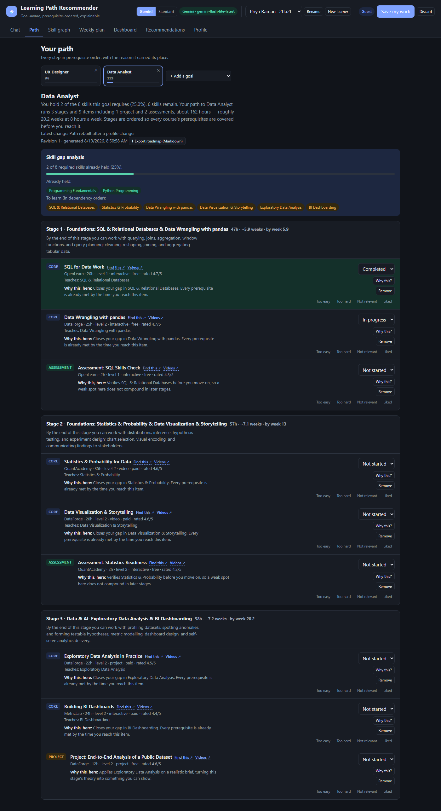

Every item carries **why this, here** — the specific gap it closes and the
prerequisites that pin it in place. Skills already held are pulled out of the
gap; the ones that remain are shown in dependency order.

### The prerequisite graph the plan came from

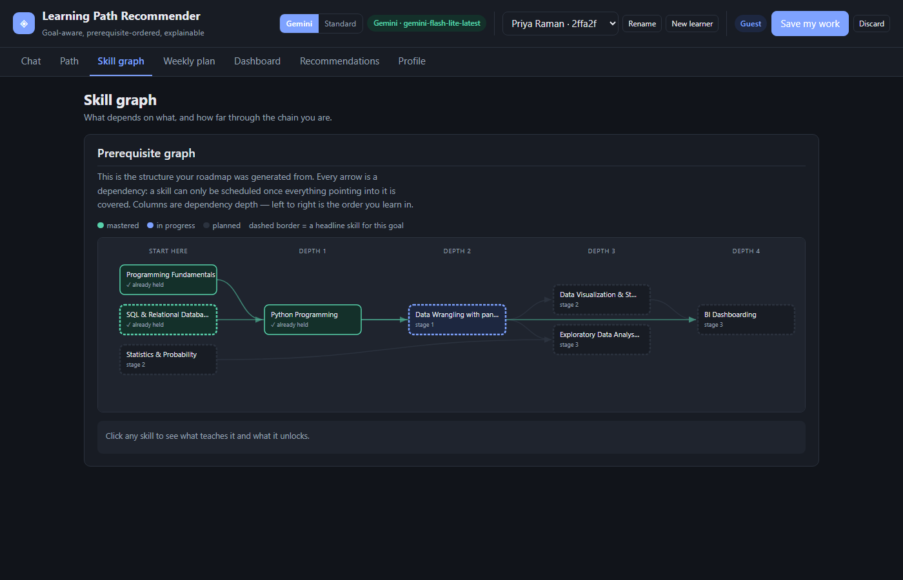

Every arrow is a constraint the planner obeyed. Columns are dependency depth, so
left to right *is* the order you learn in. A test asserts every edge points
strictly forward, which means this drawing can never contradict the plan.

### Why *this* course, in numbers

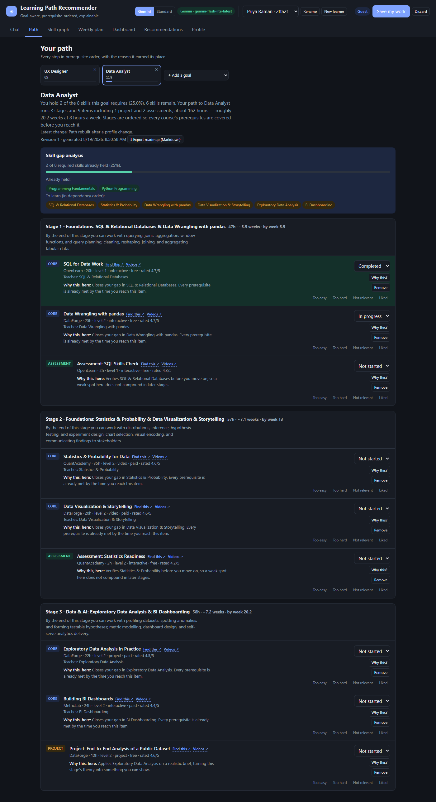

Six components, each computed independently, each multiplied by its weight. The
six contributions sum to the score at the top. Available on any item, and
linkable — `#explain/c-node` opens exactly this view.

### Progress, and the pace you are actually keeping

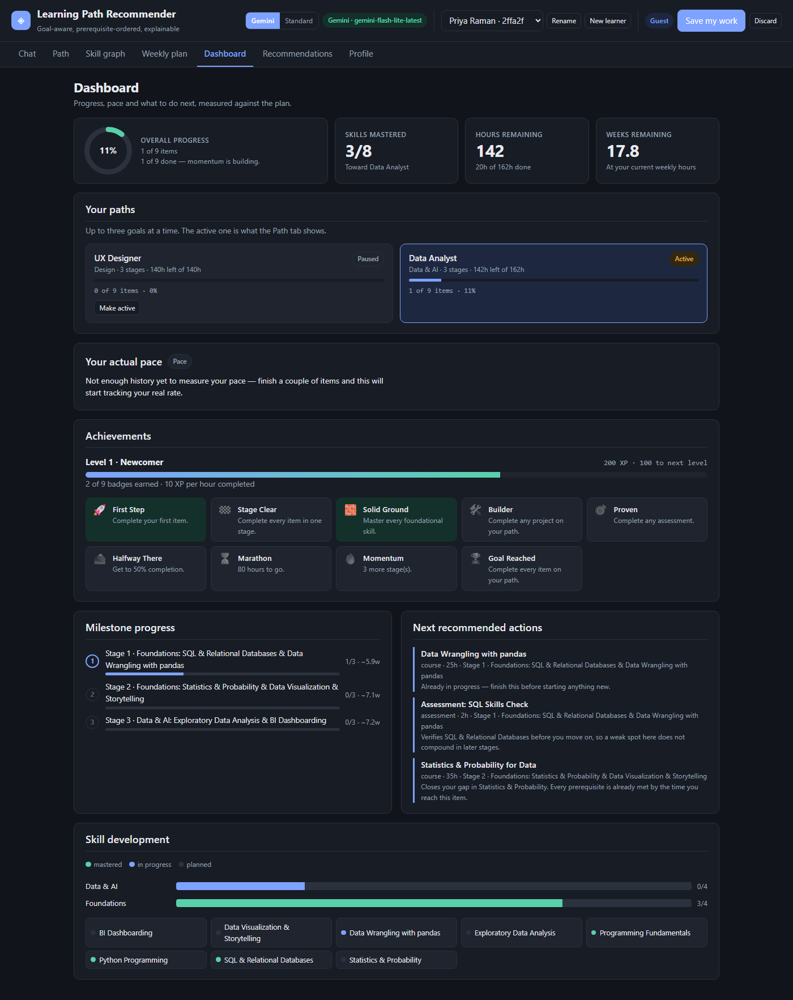

The learner planned 12 hours a week and is averaging 5.5. The system measured
that from the timestamps it already had, and offers to refit the whole schedule
around the real number.

### The rest

| | |
|---|---|
| 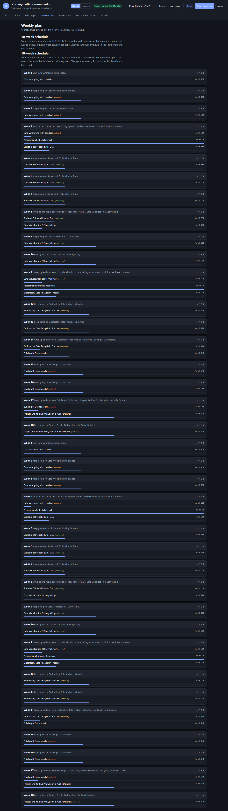 | **Weekly plan** — the roadmap poured into fixed-capacity weeks. "445 hours" becomes "week 3: wrap up Modern JavaScript, start Data Structures". |
| 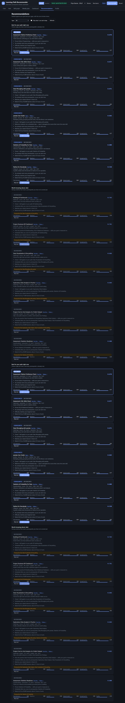 | **Recommendations** — ranked and filterable, each with its six-component breakdown visible inline. |
| 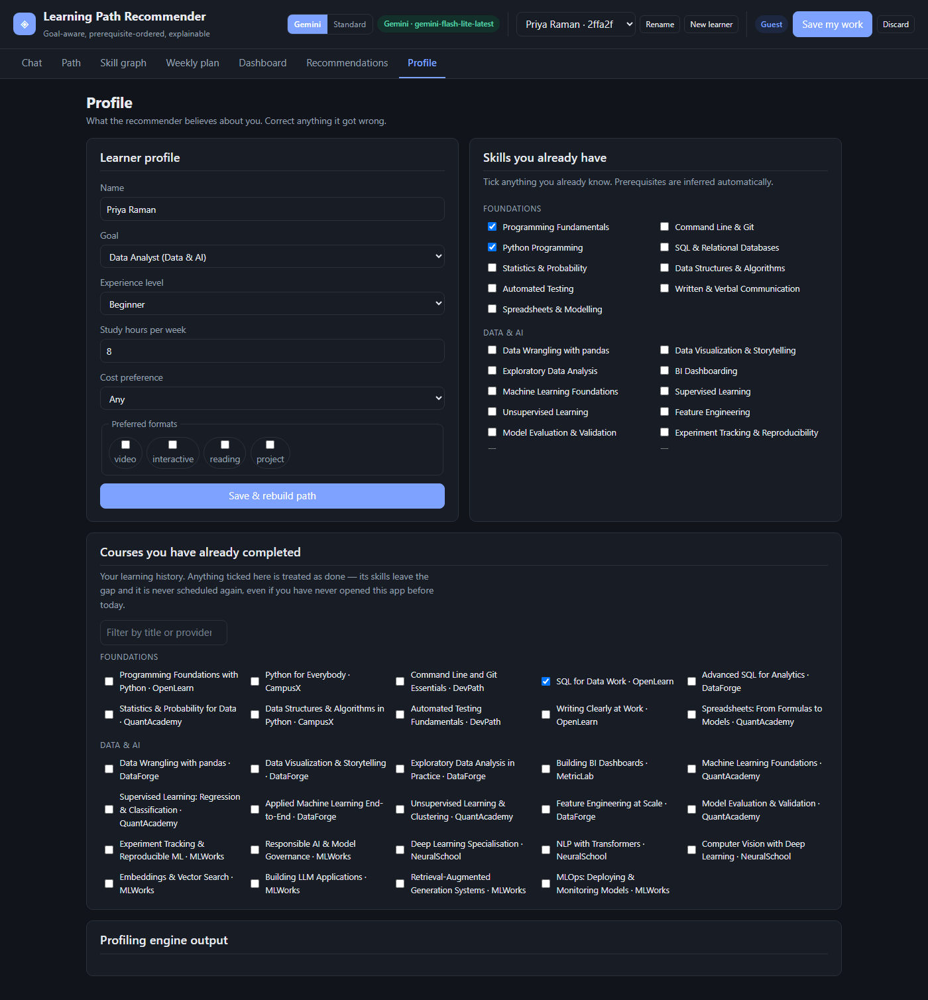 | **Profile** — declared skills, preferences, and the prior courses you finished before this app existed. |

---

## How it works

Six stages, each a pure function of the one before it.

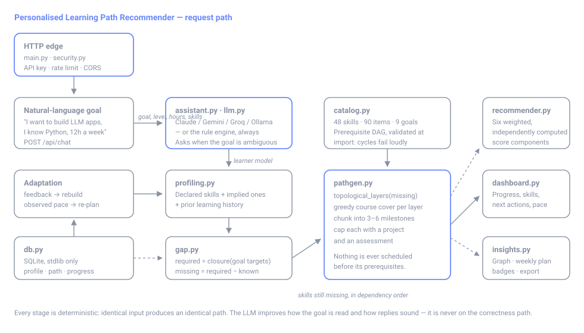

| Stage | Input → output | Method |
|---|---|---|
| **Interpret** | free text → goal, level, hours, known skills | LLM structured extraction, deterministic keyword engine underneath |
| **Clarify** | ambiguous text → a question | relative-ambiguity test over goal match scores |
| **Profile** | declared skills → declared **plus implied** | transitive closure over the prerequisite graph |
| **Gap** | goal + profile → what is missing | `closure(goal targets) − known` |
| **Generate** | missing skills → milestones | layered topological sort, then greedy multi-skill cover |
| **Explain** | roadmap → rationale per item | the scoring components, rendered as sentences |

<details>
<summary><strong>Module map</strong></summary>

| Module | Responsibility |
|---|---|
| `catalog.py` | Loads and **validates** the catalog; graph queries (closure, layers, depth) |
| `profiling.py` | Learner profiling; folds feedback into the profile |
| `gap.py` | Skill gap analysis and its plain-language explanation |
| `recommender.py` | Weighted, explainable scoring of every catalog item |
| `pathgen.py` | Milestone path generation with prerequisites |
| `dashboard.py` | Progress, skill development, next actions |
| `insights.py` | Skill graph, weekly plan, achievements, pace, Markdown export |
| `assistant.py` | Atlas: NL understanding and Q&A, with a full rule-based fallback |
| `llm.py` | Provider-agnostic LLM layer (Anthropic / Gemini / Groq / OpenRouter / Ollama) |
| `security.py` | Optional API key, rate limiting, response headers |
| `db.py` | SQLite persistence (stdlib only) |
| `main.py` | FastAPI routes + static hosting |

</details>

<details>
<summary><strong>Two decisions worth defending</strong></summary>

**Uncoverable skills cascade.** If learner feedback excludes the only course
teaching a skill, that skill *and everything downstream of it* is reported as
uncovered rather than scheduled anyway. Promising a course whose prerequisite
the path never teaches would be worse than admitting the gap.

**Generation is deterministic.** Identical inputs always produce an identical
path — ties are broken by explicit sort keys, never by dict ordering. Without
this, the invariant tests could not exist.

</details>

---

## Nothing is a black box

Every recommendation is a weighted sum of six independently computed components,
all returned to the client:

| Component | Weight | Meaning |
|---|---:|---|
| `goal_relevance` | 0.35 | Fraction of the item's value landing on skills you still need |
| `skill_readiness` | 0.20 | Fraction of its prerequisites you already hold |
| `level_fit` | 0.15 | Closeness to your difficulty target (feedback-adjusted) |
| `interest_match` | 0.15 | Domain overlap with your stated interests |
| `format_fit` | 0.10 | Format, cost, and provider preferences |
| `quality` | 0.05 | Rating, with popularity as a weak tiebreaker |

The same numbers that produce the ranking generate the human-readable reasons,
so *"why was this recommended?"* always has a precise, checkable answer.

---

## It adapts to what you actually do

**Feedback rebuilds the path.** Mark something *too easy* / *too hard* /
*not relevant* and the roadmap is regenerated around the change — the item
excluded, the difficulty target shifted, similar providers favoured.

**Pace is measured, not assumed.** Every learner overestimates their weekly
hours. The progress table already records when each item changed state, so the
real rate is computable:

```
You planned 12h a week and are averaging 5.5h. At your real rate the rest takes
about 67.3 weeks rather than 30.8. Re-planning around 6h would give you dates
you can actually trust.
```

Below a week of history it reports `unknown` rather than inventing a trend.
`POST /replan` refits the schedule — deliberately an explicit action, because a
plan that moves underneath you is worse than a slightly stale one.

**Prior history counts.** Tick the courses you finished before this app existed;
their skills leave the gap, they are never scheduled, and — unlike progress
entries — they survive every rebuild.

**Progress survives rebuilds.** Completing a course removes its skill from the
gap, so the next rebuild drops that course from the plan. The dashboard still
counts it: a learner's finished work must not vanish because the path moved on.

---

## The assistant works without an API key

The assistant is **Atlas**, a coaching persona rather than a query responder. It
opens with the answer, cites the learner's own courses and hours, and closes
with one concrete nudge.

Goal understanding and Q&A are implemented **twice**. With no provider
configured, a deterministic rule engine handles both — and it is written to
sound like a coach, not a form letter: it varies phrasing, names the learner, and
cites their actual stage. The variation is seeded from the input, so it stays
fully deterministic and testable.

That fallback is not a rare path. Free tiers run out, networks fail, keys expire
— so the rule engine is what a real user meets sooner or later, and it is built
to survive how people actually type:

| They send | It does |
|---|---|
| `i wnat to be data analist` | Builds the Data Analyst path — shorthand is expanded, and remaining typos are matched fuzzily |
| `hi` | Welcomes them and asks for a goal, with an example |
| `help`, `what is this` | Explains what the product does and what to type |
| `i dont know what i want` | Offers the domains and asks what they'd enjoy doing, not for a job title |
| `i already know sql` | Credits the skill and **rebuilds the path around it** |
| `i want to be a frontend enginer` | Switches goal outright — while `should i be a frontend engineer?` does not |
| `this is useless` | Names the two levers that would actually change the plan |

| Provider | Env var | Cost |
|---|---|---|
| **Google Gemini** | `GEMINI_API_KEY` | **Free tier, no card** — recommended |
| **Groq** | `GROQ_API_KEY` | **Free tier**, very fast open models |
| **Ollama** | `LLM_PROVIDER=ollama` | **Free forever**, fully local, works offline |
| OpenRouter | `OPENROUTER_API_KEY` | Free `:free` models |
| Anthropic Claude | `ANTHROPIC_API_KEY` | Paid credits |

```bash
cp .env.example .env      # then set one provider key
```

Everything a provider returns is treated as untrusted: unknown goal or skill ids
are discarded, out-of-range hours rejected, invalid levels filtered, and JSON
recovered from markdown fences or surrounding prose. Any failure — no
credential, network error, rate limit, refusal, malformed output — degrades to
the rule engine rather than surfacing an error. **No provider adds a
dependency**: the whole layer is stdlib `urllib`.

---

## Catalog integrity

85 skills, 139 learning items, 14 goals across nine domains — validated
exhaustively at import. `CatalogError` is raised for:

- a prerequisite that does not resolve, or a skill requiring itself
- **any cycle** in the prerequisite graph (Kahn's algorithm)
- an item referencing an unknown skill, or teaching and requiring the same one
- an item requiring a skill that transitively depends on something it teaches
- **any skill no course teaches** — otherwise a path could contain an unfillable gap
- out-of-range levels, ratings, hours, formats, costs, or duplicate ids

This runs at startup and in `run.py`, so broken data fails loudly instead of
producing a subtly wrong roadmap. To extend the catalog, edit
`backend/data/{skills,courses,goals}.json` and run the tests.

The catalogue is deliberately not only for developers. Alongside Data & AI, Web
Development and Cloud & DevOps sit **Business & Product, Marketing, Design,
Finance & Accounting and Mathematics** — and Mathematics is a *subject* rather
than a job title, because wanting to learn something is a goal even when no
role is attached to it. Every goal is reachable from plain language ("I want to
become a product manager", "help me get better at maths"), and every one is
asserted to produce a real, prerequisite-ordered path in `test_catalog.py`.

---

## Accounts, guests, and several paths at once

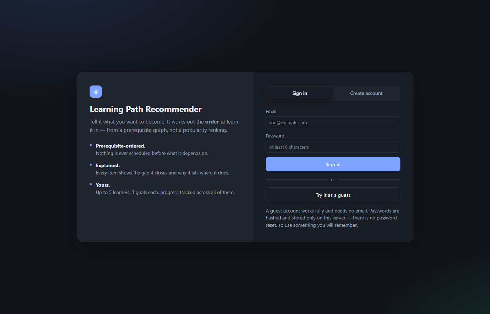

Signing in is optional by design, and the door is not a wall:

- **Continue as a guest** and everything works immediately — no email, no
  password, nothing to verify. A guest is a real account with a throwaway
  identity, so the work is saved from the first message.
- **Keep your work** turns that guest into a permanent account *in place*. The
  user id never changes, so every learner, path, message and completed item
  stays exactly where it is. Nothing is migrated and nothing is lost.
- Every learner, path and message is scoped to one account. Another account
  cannot list them and cannot read them by id — asserted in `test_accounts.py`.

There is no email verification and no password reset, because both need a mail
service the project does not have. That is an honest limit of a demo rather
than an oversight.

### More than one goal at a time

A learner runs up to three goals side by side, with one active. The Path tab
switches between them, and the dashboard shows each with its own progress. This
matters because real people do not stop wanting one thing when they start
wanting another — someone learning data analysis at work may be learning design
in the evenings.

### The engine switch


The header carries a switch between the configured model and the **Standard**
rule engine, and a badge naming which one will answer the next message. Every
reply also says which engine produced it.

This is not decoration. When a free-tier key runs out of quota the app degrades
to the rule engine silently and keeps working — which means you can be reading
rule-engine output and concluding the model is bad. The badge and the per-reply
line make that visible rather than mysterious.

### Where the data lives

By default the whole application state is one SQLite file you can delete to
reset. Set `DATABASE_URL` and the identical SQL runs against Postgres instead.

A deployment needs the second option: a free instance has no persistent disk, so
the SQLite file — and every registered account in it — is erased whenever the
instance sleeps. `GET /api/health` reports `"storage"` so you can check which
one a deployment actually got rather than assuming.

Put the database in the same region as whatever serves the app. Each request
makes several round trips, so a cross-region pairing is felt immediately: a
Singapore instance against a `us-east-2` database took over seven seconds to
load a page that is otherwise instant.

---

## API

Interactive docs at `/docs` while the server runs.

| Method | Endpoint | Purpose |
|---|---|---|
| `GET` | `/api/health` | Status, catalog size, live assistant engine, storage engine, gate settings |
| `POST` | `/api/auth/{register,login,guest,logout}` | Create an account, sign in, start a guest session, sign out |
| `POST` | `/api/auth/upgrade` | Turn a guest into a permanent account, keeping all of its work |
| `GET` | `/api/auth/me` | The signed-in user, or `{"signed_in": false}` |
| `GET` | `/api/catalog/{goals,skills,items}` | Browse the catalog |
| `GET/POST` | `/api/learners` | List learners / create one |
| `DELETE` | `/api/learners/{id}` | Delete a learner and everything of theirs |
| `GET/PATCH` | `/api/learners/{id}/profile` | Read/update the profile (rebuilds the path) |
| `GET` | `/api/learners/{id}/profile/summary` | Profiling output, incl. implied skills |
| `POST` | `/api/chat` | Conversational interface — states a goal or asks a question |
| `GET/DELETE` | `/api/learners/{id}/conversation` | Chat history; clear it |
| `GET/POST` | `/api/learners/{id}/path` | Fetch or regenerate the active learning path |
| `GET/POST` | `/api/learners/{id}/paths` | List every goal in progress / start another |
| `POST` | `/api/learners/{id}/paths/{goal}/activate` | Switch which path is the active one |
| `DELETE` | `/api/learners/{id}/paths/{goal}` | Drop one goal, keeping the others |
| `GET` | `/api/learners/{id}/gap` | Skill gap report + explanation |
| `GET` | `/api/learners/{id}/recommendations` | Ranked, explained recommendations |
| `GET` | `/api/learners/{id}/explain/{item_id}` | Full justification for one item |
| `GET/POST` | `/api/learners/{id}/progress` | Track item status |
| `GET/POST` | `/api/learners/{id}/feedback` | Adapt the path from feedback |
| `GET` | `/api/learners/{id}/dashboard` | Progress, skills, milestones, next actions, pace |
| `GET` | `/api/learners/{id}/graph` | Prerequisite DAG in dependency layers |
| `GET` | `/api/learners/{id}/plan` | Week-by-week schedule at real hours |
| `GET` | `/api/learners/{id}/pace` | Observed study rate versus the planned one |
| `POST` | `/api/learners/{id}/replan` | Refit the schedule to the observed rate |
| `GET` | `/api/learners/{id}/achievements` | XP, level, and badges |
| `GET` | `/api/learners/{id}/export` | The roadmap as shareable Markdown |

---

## Testing

**448 tests at 90% branch coverage**, all offline and deterministic — no
network, no API key, no tokens. The database is pinned to SQLite for the
same reason, so a configured `DATABASE_URL` can never send a test suite to
a real server.

```bash
pip install -r requirements-dev.txt
python -m pytest          # ~4s
python -m ruff check .
```

The load-bearing test is `assert_prerequisites_respected` — it walks a path in
the exact order a learner would and fails if any item is reached before the
skills it requires. It runs across all 14 goals × 3 experience levels.

<details>
<summary><strong>What each suite proves</strong></summary>

| File | Covers |
|---|---|
| `test_catalog.py` | Catalog integrity, graph properties, and **negative cases** — cycles, dangling refs and unteachable skills each proven to raise |
| `test_pathgen.py` | The prerequisite invariant across every goal and level, full gap coverage, determinism, exclusions |
| `test_engines.py` | Profiling, implied skills, gap analysis, score bounds, ranking, feedback adaptation |
| `test_llm_providers.py` | Each adapter's exact request shape and response parsing, JSON recovery, provider priority |
| `test_assistant_llm.py` | Hallucinated ids, out-of-range values, prose instead of JSON, and total API failure all degrade correctly |
| `test_insights.py` | Graph edges point forward, weekly plans never exceed capacity, achievements are monotonic |
| `test_adaptation.py` | History survives rebuilds, pace is measured and re-planned around, resources are never scheduled, vague goals are asked about |
| `test_security.py` | The limiter's sliding window, the API-key gate, payload bounds, response headers |
| `test_conversation.py` | Typos, greetings, meta questions, goal switching, and mid-chat skill claims — all against the rule engine |
| `test_frontend.py` | Every selector resolves, every endpoint called exists, nothing loads from a remote host |
| `test_api.py` | Every endpoint, validation errors, and a full journey: chat → path → progress → feedback → dashboard |
| `test_accounts.py` | Registration, sign-in, guest upgrade in place, and that one account can never see another's learners |
| `test_sqlstore.py` | The SQLite/Postgres seam: placeholder and DDL translation, engine selection, and the channel-binding fallback |
| `test_paths.py` | Several goals per learner, the active-path rule, and the cap on how many run at once |

</details>

CI runs lint, catalog validation, and the full suite on Python 3.10–3.12 plus
Windows, then builds the Docker image and boots it to check `/api/health`.

---

## Serving it to other people

Locally the app needs no configuration. The moment it is reachable by anyone
else, four environment variables matter — no code changes:

| Variable | Default | Set it to |
|---|---|---|
| `API_KEY` | unset | a shared secret; every `/api` route except `/api/health` then needs it |
| `ALLOWED_ORIGINS` | `*` | the exact browser origins you serve from |
| `RATE_LIMIT_PER_MINUTE` | `240` | per-caller budget across the API |
| `RATE_LIMIT_CHAT_PER_MINUTE` | `20` | budget for `POST /api/chat` alone |

`/api/chat` gets its own, much tighter budget: it is the only route that spends
provider tokens, and the only one that creates a learner record for an unseen id.
Ids are pattern-checked, messages capped at 2000 characters, and every response
carries `nosniff`, `DENY`, and `same-origin`.

```bash
docker build -t learning-path-recommender .
docker run -p 8000:8000 -v lpr-data:/data --env-file .env learning-path-recommender
```

Non-root, with SQLite on a volume. State is one file (`LEARNING_DB_PATH`);
delete it to reset. Nothing else to migrate or back up. The container honours
`$PORT`, so it runs unchanged on Render, Railway, Fly, or Cloud Run.

**Deploying to Render:** [`render.yaml`](render.yaml) is a ready blueprint —
*New → Blueprint → pick this repo*, then set `GEMINI_API_KEY` when prompted (or
skip it; the rule engine needs no key). CI builds this image and boots it on
every push, so what deploys is what was tested.

---

## Project layout

```
backend/
  data/{skills,courses,goals}.json   catalog data
  catalog.py  profiling.py  gap.py  recommender.py
  pathgen.py  dashboard.py  insights.py
  assistant.py  llm.py  security.py  accounts.py
  models.py  db.py  sqlstore.py  config.py  main.py
frontend/
  index.html  styles.css  app.js     no build step, no CDN
tests/                               448 tests, all offline
docs/                                architecture, screenshots, solution write-up
.github/workflows/ci.yml             lint, tests, catalog check, Docker boot
Dockerfile  pyproject.toml  run.py  make_zip.py
```

The frontend is dependency-free vanilla JS, theme-aware, and every tab is
deep-linkable (`#path`, `#dashboard`, `#explain/<item-id>`).

---

## Author

Vangara Yaswanth Sai

Full write-up — problem understanding, approach, architecture, AI/ML techniques,
features, and challenges — in
[docs/solution-documentation.html](docs/solution-documentation.html).
